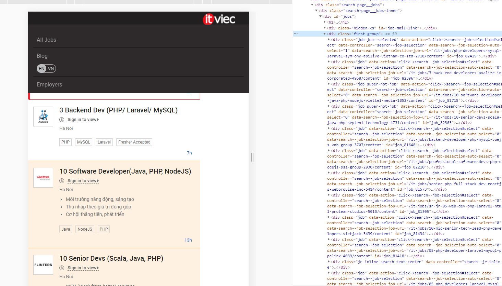
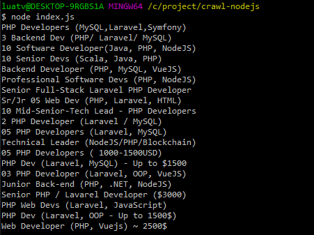
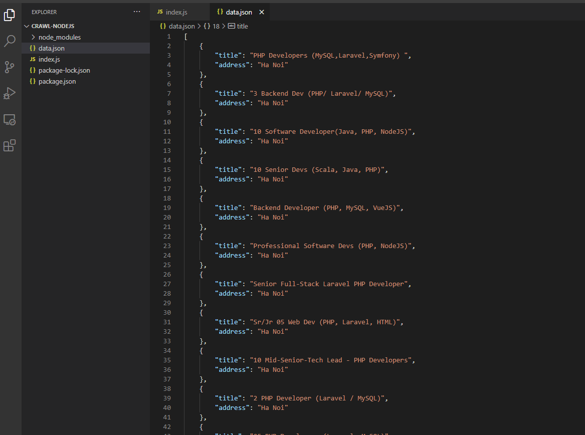

#Crawl dữ liệu từ trang web khác

###Mở đầu

Hiện nay với thời đại công nghệ hóa, hiện đại hóa chúng ta có thể tìm kiếm bất kì thông tin nào trên website. 
Nhưng nếu với hàng ngàn thông tin như thế làm sao chúng ta có thể tổng hợp về kho dữ liệu của chúng ta?
Điều này hoàn toàn có thể làm được và sử dụng thông tin hợp pháp. 
Vậy chúng ta nên làm thế nào ? 

1. Ta có thể kết nối trực tiếp đến trang web ấy thông qua API họ cung cấp.
2. Chúng ta tổng hợp những thông tin mà họ đã xử lý và hiện thị trên web của họ.

Với trường hợp 1 chúng rất dễ dàng lấy được dữ liệu. Nhưng không phải web nào cũng có API để chúng ta kết nối vào.
Do vậy ở bài này ta cùng đi tìm hiểu bước khởi đầu để lấy được dữ liệu web khác về kho của mình.

###Nội dung

Có rất nhiều công cụ để ta sử dụng cho việc này. Ở bài tìm hiểu lần này mình sử dụng NodeJS để thực hiện `Crawl`.

**1. Cài đặt dự án**

```js
$ mkdir crawl-nodejs 
$ cd crawl-nodejs 
$ npm init  
$ touch index.js
```
Sau khi cài xong dự án ta tiến hành cài các thư viện cần thiết.
- `cheerio` Là một thư viện giúp chúng load html(có thể hiểu nó lấy cấu trúc html về vậy)
- `request-promise` Là một thư viện giúp ta lấy thông tin sau khi `cheerio` load html
Tài liệu mình để ở cuối bài.

Cài đặt chúng ta sử dụng lệnh sau:
```js
$ npm install cheerio request-promise
```
 **2. Kết nối đến website khác**
 
Ta vào file `index.js`
```js
const cheerio = require('cheerio');
const rp = require('request-promise');

rp('https://itviec.com/it-jobs/php/ha-noi', (error, response, html) => {
    console.log(response.statusCode); // 200, kiểm tra xem kết nối thành công không
})
```

 **3. Phân tích và lấy dữ liệu**




Hiện ra trước mắt là thông tin chúng ta sẽ tổng hợp..chúng ta tiến hành `Inspect browser` lên để kiểm tra cấu 
trúc phần tử.
 
 Ta thấy các khối thông tin được bao bọc bởi `class ='job'`. Tiến hành lặp và truy cập các phần tử bên trong
```js
const cheerio = require('cheerio');
const rp = require('request-promise');


rp('https://itviec.com/it-jobs/php/ha-noi', (error, response, html) => {
  if(!error && response.statusCode == 200) {
    const $ = cheerio.load(html); // load HTML
    $('.job').each((index, el) => {
      const title = $(el).find('.job__description > div.job__body > div > h2 > a').text();
      console.log(title);
    })
  } else {
    console.log(error);
  }
});
```

Với đoạn code trên ta đã load html về local của chúng ta và tiến hành phân tích, lấy dữ liệu từ cấu trúc html.

Kết quả của chúng ta.



Bây giờ chúng tiếp tục lấy thêm dữ liệu và lưu vào file.

```js
const cheerio = require('cheerio');
const rp = require('request-promise');
const fs = require('fs');

rp('https://itviec.com/it-jobs/php/ha-noi', (error, response, html) => {
  if(!error && response.statusCode == 200) {
    const $ = cheerio.load(html); // load HTML
    let data = [];

    $('.job').each((index, el) => {
      const title = $(el).find('.job__description > div.job__body > div > h2 > a').text();
      const address = $(el).find('.job__description > div.job__body > div > div.visible-xs > div > div').text();

      data.push({
        title, address
      });
    })
    fs.writeFileSync('data.json', JSON.stringify(data));
  } else {
    console.log(error);
  }
});
```

Kết quả chúng ta thu được


#Kết Luận

Qua bài này chúng ta đã biết sơ qua về cách lấy được dữ liệu web khác về kho của mình. Tiếp đến chúng ta sẽ đi sâu hơn để
lấy được nhiều dữ liệu hơn

#Tài Liệu

https://www.npmjs.com/package/cheerio

https://github.com/request/request-promise
